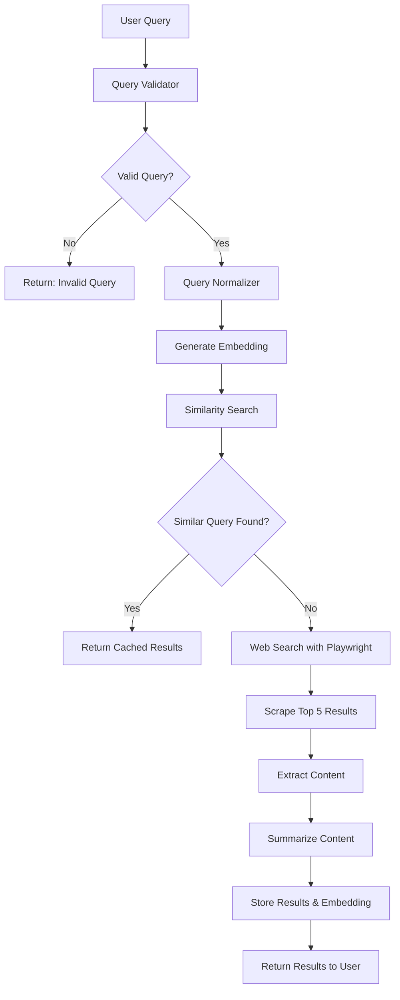

# Web Browser Query Agent - Architecture

## System Overview

The Web Browser Query Agent is an intelligent search system that processes user queries, validates them, checks for similar past queries, and performs web searches when needed. The system uses AI for query classification, similarity detection, and content summarization.

## Architecture Components

### 1. Query Processing Pipeline
- **Query Input Handler**: Accepts user queries from CLI/Frontend/API
- **Query Validator**: Uses AI to classify queries as valid/invalid
- **Query Normalizer**: Standardizes queries for similarity comparison
- **Similarity Detector**: Finds similar past queries using embeddings

### 2. Search Engine
- **Web Scraper**: Uses Playwright to scrape search results
- **Content Extractor**: Extracts and cleans content from web pages
- **Content Summarizer**: Uses AI to summarize extracted content

### 3. Data Storage
- **Query Cache**: Stores processed queries and results
- **Embedding Database**: Stores query embeddings for similarity search
- **Result Database**: Stores search results and summaries

### 4. AI Services
- **Query Classification**: Determines if query is searchable
- **Embedding Generation**: Creates vector representations of queries
- **Content Summarization**: Summarizes web page content

## System Flow



## Component Details

### Query Validator
- Uses AI to classify queries as searchable vs non-searchable
- Invalid examples: "walk my pet", "add apples to grocery"
- Valid examples: "best restaurants in NYC", "Python tutorial"

### Similarity Detection
- Uses sentence embeddings to find similar queries
- Normalizes queries (removes common words, standardizes format)
- Uses cosine similarity with threshold (e.g., 0.8)

### Web Scraping
- Uses Playwright for browser automation
- Searches Google/DuckDuckGo
- Extracts content from top 5 results
- Handles JavaScript-rendered content

### Content Processing
- Cleans HTML and extracts text content
- Removes ads, navigation, footer content
- Uses AI to summarize content (max 200 words per page)

### Data Storage
- SQLite for simple storage
- JSON files for embeddings and results
- Indexed for fast similarity search

## Technology Stack

### Backend
- **Language**: Python 3.9+
- **Package Manager**: UV (fast Python package manager)
- **Web Scraping**: Playwright
- **AI Services**: OpenAI API / Hugging Face
- **Database**: SQLite
- **Embeddings**: Sentence Transformers
- **API Framework**: FastAPI

### Frontend
- **Framework**: Next.js 14 (App Router)
- **Package Manager**: PNPM
- **Language**: TypeScript
- **Styling**: Tailwind CSS
- **State Management**: TanStack Query (React Query)
- **UI Components**: Shadcn/ui
- **HTTP Client**: Axios

### API
- **Framework**: FastAPI
- **Documentation**: OpenAPI/Swagger
- **Authentication**: JWT (optional)

## File Structure

```
WebSearchAgent/
├── backend/
│   ├── src/
│   │   ├── core/
│   │   │   ├── query_validator.py
│   │   │   ├── similarity_detector.py
│   │   │   ├── web_scraper.py
│   │   │   └── content_processor.py
│   │   ├── ai/
│   │   │   ├── embeddings.py
│   │   │   ├── summarizer.py
│   │   │   └── classifier.py
│   │   ├── storage/
│   │   │   ├── database.py
│   │   │   ├── cache.py
│   │   │   └── embeddings_store.py
│   │   ├── api/
│   │   │   ├── main.py
│   │   │   ├── routes.py
│   │   │   └── models.py
│   │   └── cli/
│   │       └── main.py
│   ├── data/
│   │   ├── queries.db
│   │   ├── embeddings.json
│   │   └── results.json
│   ├── tests/
│   ├── pyproject.toml
│   ├── uv.lock
│   └── README.md
├── frontend/
│   ├── src/
│   │   ├── app/
│   │   │   ├── page.tsx
│   │   │   ├── layout.tsx
│   │   │   └── globals.css
│   │   ├── components/
│   │   │   ├── ui/
│   │   │   ├── QueryForm.tsx
│   │   │   ├── ResultsDisplay.tsx
│   │   │   └── LoadingSpinner.tsx
│   │   ├── lib/
│   │   │   ├── api.ts
│   │   │   ├── utils.ts
│   │   │   └── hooks.ts
│   │   └── types/
│   │       └── index.ts
│   ├── public/
│   ├── package.json
│   ├── pnpm-lock.yaml
│   ├── tailwind.config.js
│   ├── tsconfig.json
│   └── next.config.js
├── shared/
│   └── types/
└── README.md
```

## Configuration

### Environment Variables

#### Backend (.env)
- `OPENAI_API_KEY`: OpenAI API key for AI services
- `HUGGINGFACE_API_KEY`: Alternative AI service
- `SIMILARITY_THRESHOLD`: Threshold for query similarity (default: 0.8)
- `MAX_RESULTS`: Number of search results to process (default: 5)
- `SUMMARY_LENGTH`: Max words per summary (default: 200)
- `DATABASE_URL`: SQLite database path

#### Frontend (.env.local)
- `NEXT_PUBLIC_API_URL`: Backend API URL
- `NEXT_PUBLIC_APP_NAME`: Application name

### Package Management

#### Backend (UV)
```bash
# Install UV
curl -LsSf https://astral.sh/uv/install.sh | sh

# Initialize project
uv init

# Add dependencies
uv add fastapi uvicorn playwright openai sentence-transformers

# Run development server
uv run uvicorn src.api.main:app --reload
```

#### Frontend (PNPM)
```bash
# Install PNPM
npm install -g pnpm

# Create Next.js app
pnpm create next-app@latest frontend --typescript --tailwind --app

# Add dependencies
pnpm add @tanstack/react-query axios @tanstack/react-query-devtools
pnpm add -D @types/node @types/react @types/react-dom

# Run development server
pnpm dev
```

### Search Engine Configuration
- Primary: Google Search
- Fallback: DuckDuckGo
- User-Agent rotation for avoiding blocks
- Rate limiting and delays

## Performance Considerations

### Caching Strategy
- Query results cached for 24 hours
- Embeddings cached permanently
- Similarity search results cached for 1 hour
- Frontend: TanStack Query caching with stale-while-revalidate

### Rate Limiting
- AI API calls: 10 requests/minute
- Web scraping: 2 requests/second
- Database queries: No limit (local SQLite)

### Scalability
- Modular design for easy scaling
- Separate services can be containerized
- Database can be migrated to PostgreSQL/Redis
- Frontend can be deployed to Vercel/Netlify

## Security Considerations

### Input Validation
- Sanitize user queries
- Prevent injection attacks
- Rate limit user requests

### API Security
- Validate API keys
- Implement request signing
- Add CORS protection

### Data Privacy
- Don't store personal information
- Encrypt sensitive data
- Implement data retention policies

## Development Workflow

### Backend Development
1. Use UV for dependency management
2. FastAPI with automatic API documentation
3. SQLAlchemy for database operations
4. Pytest for testing

### Frontend Development
1. Next.js 14 with App Router
2. TypeScript for type safety
3. TanStack Query for server state management
4. Tailwind CSS for styling
5. Shadcn/ui for components

### API Integration
1. TanStack Query for data fetching
2. Axios for HTTP requests
3. Type-safe API calls with TypeScript
4. Optimistic updates and error handling 